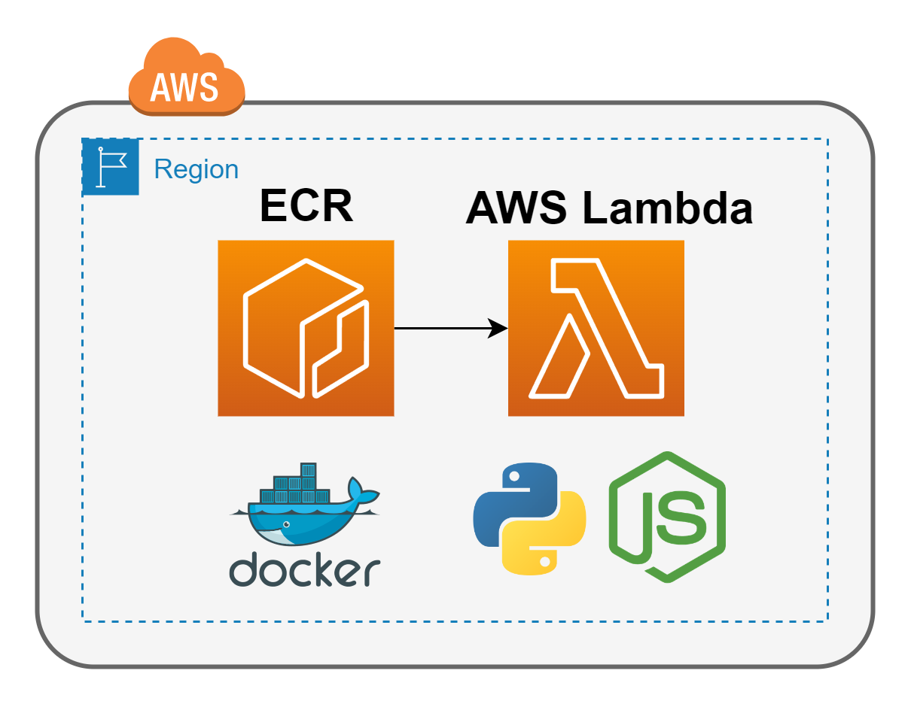

# AWS-CDK-LAMBDA-DOCKER-TEMPLATES

The purpose of this project is to showcase how to deploy AWS Lambda Functions with Docker images on top of multiple programming languages (like Python or NodeJs), so they can be used to leverage different custom solutions in a matter of minutes.

## General Architecture

 

## Python-based Approach

[Step-by-step guide Python-based Docker images for Lambda Functions](PYTHON_README.md)
